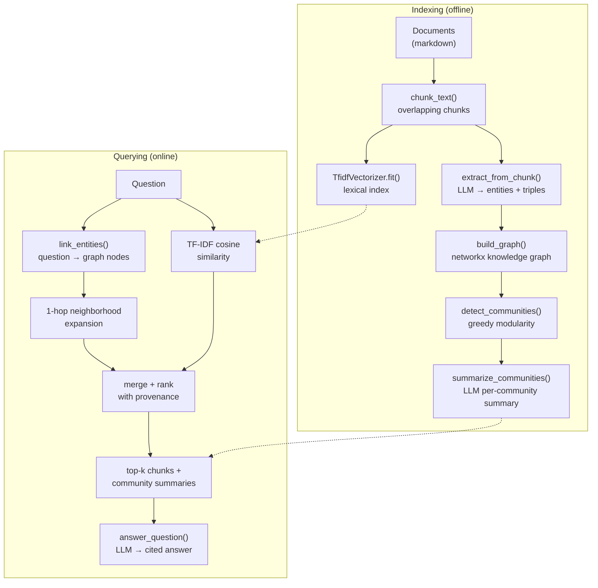

# MiniGraphRAG

A minimal but **complete** implementation of [GraphRAG](https://arxiv.org/abs/2404.16130):
index documents into a knowledge graph with an LLM, then answer questions with
**hybrid retrieval** (lexical search + graph traversal) and **cited answers**.

Built as a portfolio project to demonstrate production-style LLM engineering:
clean abstractions, defensive parsing, offline tests, and honest docs.

## What is GraphRAG, and why does it beat naive RAG on multi-hop questions?

Naive RAG chunks documents, embeds them, and retrieves the top-k chunks most
similar to the question. That works for *"Who is the CEO of Acme Corp?"* — the
answer sits in one chunk. It breaks on multi-hop questions like:

> *Who mentors the engineer leading Project Phoenix?*

No single chunk contains the answer. You need two facts from two different
documents — *Raj Patel leads Project Phoenix* and *Priya Nair mentors Raj Patel* —
and you need to **join** them. Vector similarity can't do joins; a graph can.

GraphRAG adds a knowledge-graph layer between indexing and retrieval:

1. **Extract** entities and relations from every chunk with an LLM →
   `(Priya Nair, mentors, Raj Patel)`.
2. **Connect** them into a graph and find **communities** (dense clusters of
   related entities), then summarize each community with the LLM.
3. **Retrieve** by matching question entities to graph nodes and expanding
   along edges, pulling in chunks that are *connected* to the question even
   when they share no keywords with it.
4. **Answer** from retrieved chunks + community summaries, with `[n]`
   citations mapped back to source chunks.

The graph is what turns "find similar text" into "follow the relationships."

## Architecture



## Quickstart

```bash
pip install -r requirements.txt

# 1. Index the sample docs (fictional "Acme Corp" wiki — no API key needed)
python -m minigraphrag index "data/*.md" --out index.pkl
# indexing 5 document(s) with llm=fake ...
# stats: documents=5, chunks=5, entities=30, relations=54, communities=4

# 2. Ask questions (--llm fake uses a deterministic offline mock)
python -m minigraphrag ask "Who mentors the engineer leading Project Phoenix?" --index index.pkl
```

### Example Q&A (real output, `--llm fake`)

```
Q: Who mentors the engineer leading Project Phoenix?

A: Based on the retrieved context [1] [2] [3] [4]: Key People Maya Chen —
Founder and CEO of Acme Corp. ... Raj Patel — Senior engineer leading Project
Phoenix. ... mentored by Priya Nair. ...

Citations:
  [1] doc3-chunk0: # Key People **Maya Chen** — Founder and CEO ...
  [2] doc1-chunk0: # Atlas Search ...
  [3] doc2-chunk0: # NimbusDB ... The tech lead for NimbusDB is Priya Nair ...
      NimbusDB powers both Project Phoenix and Atlas Search ...
  [4] doc4-chunk0: # Project Phoenix ... led by senior engineer Raj Patel ...
```

The `--llm fake` mock echoes retrieved context so you can verify the
**retrieval and citation machinery** without spending a cent. Point it at a
real model and the same pipeline produces fluent, cited answers:

```bash
export LLM_BASE_URL=https://api.openai.com/v1
export LLM_API_KEY=sk-...
export LLM_MODEL=gpt-4o-mini
python -m minigraphrag index "data/*.md" --out index.pkl --llm openai
python -m minigraphrag ask "Which products are powered by NimbusDB?" --index index.pkl --llm openai
```

Any OpenAI-compatible endpoint works (Ollama, vLLM, llama.cpp server, ...).

The `data/` folder ships 5 short docs about the fictional Acme Corp plus
`demo_questions.txt` — try all three, including the multi-hop one:

| Question | Type | Why it's interesting |
|---|---|---|
| Who is the CEO of Acme Corp? | single-hop | baseline naive RAG also gets this |
| Which products are powered by NimbusDB? | cross-document | answer spans 3 docs |
| Who mentors the engineer leading Project Phoenix? | **multi-hop** | requires joining 2 facts via the graph |

## Project structure

```
minigraphrag/
├── minigraphrag/
│   ├── llm.py        # LLMClient protocol; OpenAICompatibleLLM (env-configured);
│   │                 # FakeLLM — deterministic offline mock for tests/demo
│   ├── extract.py    # chunking + LLM triple extraction with defensive JSON parsing
│   ├── graph.py      # networkx graph build, greedy-modularity communities, LLM summaries
│   ├── retrieve.py   # hybrid retrieval: TF-IDF + graph neighborhood expansion
│   ├── answer.py     # cited answer generation ([n] → source chunk mapping)
│   ├── pipeline.py   # MiniGraphRAG: index() / query() / save() / load()
│   └── cli.py        # `index` and `ask` commands
├── data/             # sample Acme Corp docs + demo_questions.txt
├── tests/            # pytest suite (FakeLLM only — no network, no API keys)
├── .github/workflows/ci.yml
├── requirements.txt
└── README.md
```

Library use is just as short as the CLI:

```python
from minigraphrag import MiniGraphRAG, OpenAICompatibleLLM

rag = MiniGraphRAG(OpenAICompatibleLLM()).index(documents)
answer, retrieved = rag.query("Who mentors the engineer leading Project Phoenix?")
print(answer.text)
for c in answer.citations:
    print(f"[{c.number}] {c.chunk_id}")
rag.save("index.pkl")
```

## Design decisions

- **TF-IDF instead of embeddings by default.** Dense embeddings need a model
  download or an API key; TF-IDF runs anywhere with zero setup and is a
  surprisingly strong baseline for small corpora. The lexical pass is isolated
  in `Retriever`, so swapping in `sentence-transformers` is a localized change.
- **networkx for the graph.** For a single-machine knowledge graph (thousands
  of nodes), networkx is the right tool: battle-tested community detection,
  trivial to inspect/debug, no server to run. A production deployment would
  move to a persistent graph store (Neo4j, Neptune).
- **Defensive extraction parsing.** Real LLMs wrap JSON in fences, trail
  commas, or go off-schema. The parser tries strict JSON → JSON-span
  extraction → `head | relation | tail` line fallback → empty result, so one
  bad chunk never kills an indexing run.
- **LLM client is never pickled.** `save()`/`load()` persist the index only;
  the client (and its credentials) is passed back in on `load()`. API keys
  should never land in an artifact file.
- **Citations are parsed, not trusted.** `[n]` markers in the model's output
  are mapped back to the retrieved chunks, so every citation in an `Answer`
  is machine-checkable.

## Limitations & roadmap

- Entity linking is substring matching — fine for the demo corpus, but a
  production system wants an LLM or embedding-based linker for aliases
  ("NimbusDB" vs "Nimbus").
- Single-hop graph expansion and greedy modularity are the simple choices;
  Leiden community detection and multi-hop expansion with edge-weight decay
  would scale better.
- No incremental indexing yet — `index()` rebuilds from scratch.
- Roadmap: dense-embedding retriever option, eval harness (faithfulness /
  context recall on the demo questions), incremental updates, async batched
  extraction.

## License

MIT — see [LICENSE](LICENSE).
